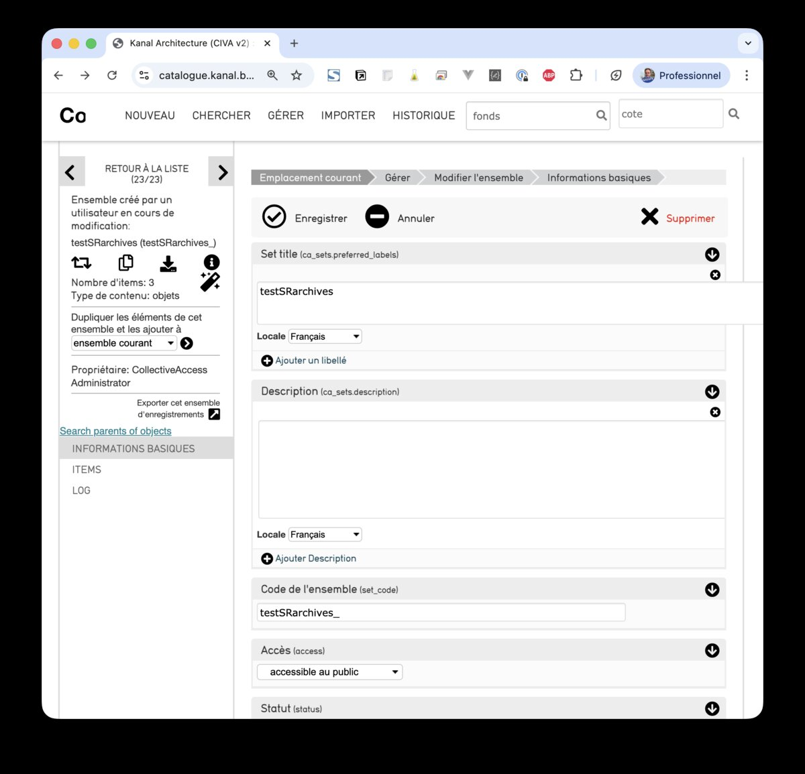

# searchParent

Plugin Providence qui ajoute un lien **"Search parents of objects"** dans l'inspecteur d'un lot (`ca_sets`). Ce lien lance une recherche federee sur les `parent_id` de tous les objets contenus dans le lot, ce qui permet de retrouver et d'editer en une fois les fiches parentes des objets regroupes dans le lot.

## Installation

Copier le dossier dans `app/plugins/` de Providence :

```bash
cp -r searchParent /chemin/vers/providence/app/plugins/
```

## Configuration

Le plugin est **desactive par defaut**. Pour l'activer sur une instance, creer un fichier `conf/local/searchParent.conf` (non versionne) :

```
enabled = 1
max_parents = 100
```

Si le fichier `conf/local/searchParent.conf` n'existe pas, le plugin lit `conf/searchParent.conf` (valeurs par defaut, `enabled = 0`).

### Parametres

- `enabled` — `1` pour activer, `0` pour desactiver
- `max_parents` — nombre maximum de parents pris en compte (defaut : 100). Au-dela, le lien n'est pas affiche car l'URL de recherche serait trop longue.

## Utilisation

Le lien apparait **uniquement dans le panneau d'inspecteur (gauche) d'un lot `ca_sets`**, pas dans la fiche d'un objet.

**Acces :** menu *Gerer → Lots*, ou URL directe `/index.php/manage/sets/SetEditor/Edit/set_id/<id>`.

Conditions d'affichage :
1. Le lot doit etre type (champ `table_num` non null, en general `ca_objects`)
2. Au moins un des objets contenus dans le lot doit avoir un `parent_id` non null
3. Le nombre total de parents distincts doit etre `<= max_parents`



Au clic, le plugin soumet un formulaire `POST` vers `/index.php/find/SearchObjects/Index` avec une recherche du type :

```
ca_objects.object_id:42 OR ca_objects.object_id:57 OR ca_objects.object_id:103 ...
```

Le resultat est la liste des fiches parentes ouvrable individuellement.

## Fonctionnement technique

- Hook utilise : `hookAppendToEditorInspector`
- Declenche sur les fiches dont `tableName() == "ca_sets"` et `t_item->get("table_num")` est non null
- Requete SQL : agregat des `parent_id` distincts non nuls des objets du lot (jointure `ca_set_items` + `ca_objects`)

## Permissions

Aucune action de role specifique. Le plugin s'affiche pour tout utilisateur autorise a editer un lot.
